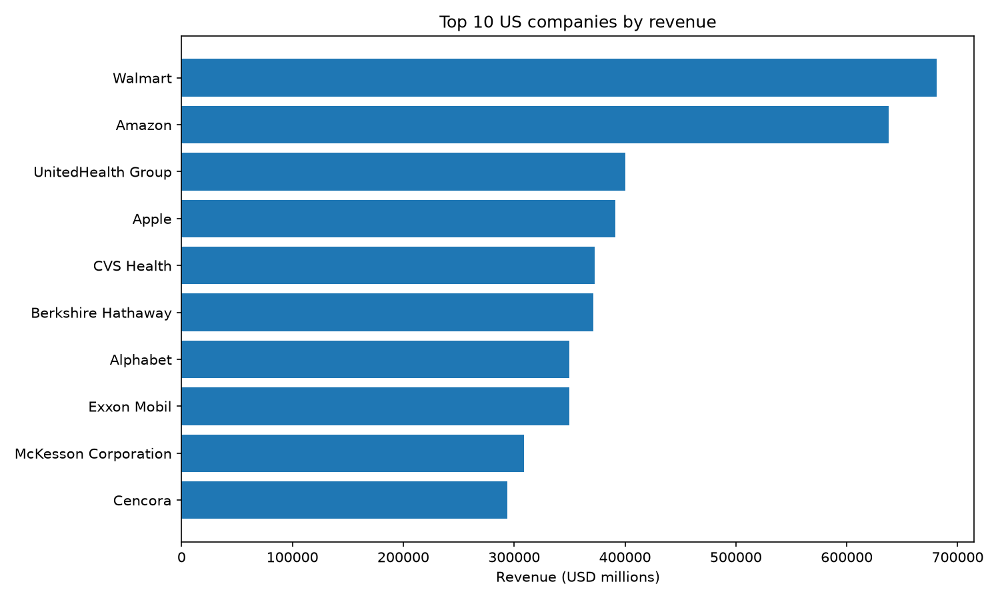
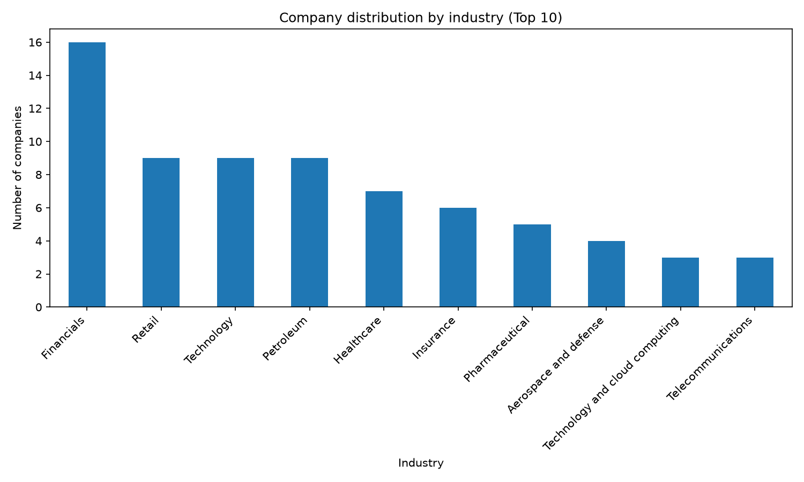
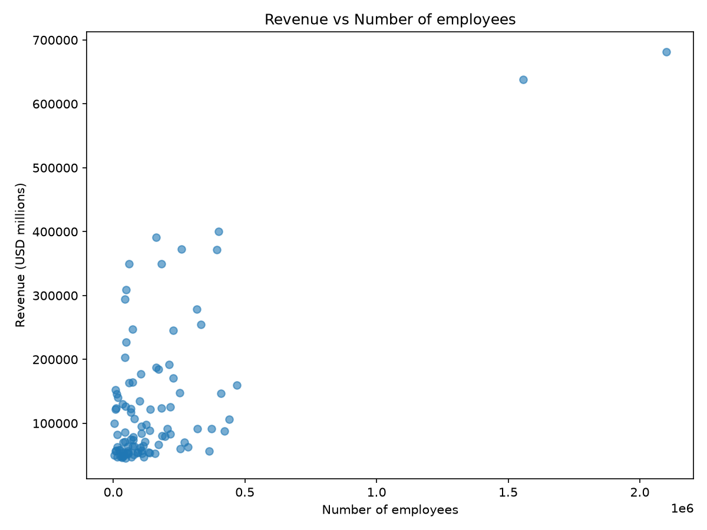

# US Companies Revenue Scraper & Analysis

A Python project that scrapes the Wikipedia list of the largest US companies by revenue, cleans the data, and generates visual insights.

## What it does
1. Scrapes company data (rank, name, industry, revenue, employees, headquarters) from Wikipedia
2. Cleans and converts the data into proper numeric types
3. Generates charts and summary insights

## Tech stack
- `requests` — HTTP requests
- `BeautifulSoup` — HTML parsing
- `pandas` — data manipulation
- `matplotlib` — data visualization

## Installation

```bash
git clone https://github.com/mariem-BM/us-companies-revenue-scraper.git
cd us-companies-revenue-scraper
pip install -r requirements.txt
```

## Usage

```bash
python scraper.py
python analyze.py
```

`scraper.py` generates `companies.csv`.
`analyze.py` reads that CSV and generates 3 PNG charts plus printed insights.

## Key insights
- **Top 3 companies by revenue**: Walmart, Amazon, UnitedHealth Group
- **Most represented industries**: Financials, Retail, Technology
- **Revenue / employees correlation**: 0.69 — a moderate positive relationship, meaning company size (employees) is linked to revenue but doesn't fully explain it. A few companies generate very high revenue relative to their employee count.

## Charts





## Project structure
scraper.py # scraping + data cleaning
analyze.py # charts + insights
requirements.txt
.gitignore
README.md

## Possible improvements

- Add unit tests for parsing and cleaning functions
- Track data over time with a scheduler + database
- Compare with other regions/countries